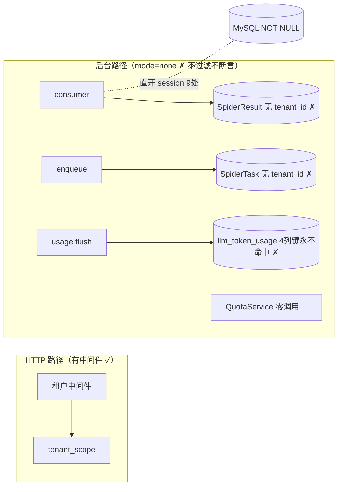
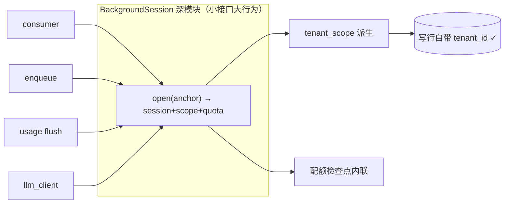

# 全栈架构评审与深化候选（2026-09-02）

> 定位：43 张工单（E0 + A + B + SaaS S1-S5）落地后的**全栈架构整理方案**，供审核。
> 范围：前端 / 后端 / 数据库设计 / 日志 / 缓存 / 安全 / SaaS 功能设计合理性与配套管理面。
> 方法：三路代码勘察（后端 / 数据·缓存·日志·安全 / 前端·管理功能），用 **module · interface · depth · seam · adapter** 词汇评估，
> 逐候选项附**删除测试**判定（删掉它，复杂度是**集中重现** = 真深模块，还是只是搬走 = 浅壳）。
> 基线：`474089e`（后端 703 passed，双前端 test+build 绿，check-arch 13 红线全绿）。
> 状态：**待审核——本文不含接口设计**；选定候选后进入拷问环节（决策树：约束 / 依赖 / 深化后形状 / 缝后坐什么 / 哪些测试存活），边定边沉淀 `CONTEXT.md` 词汇与 ADR。

---

## 核心结论（TLDR）

**上一批 SaaS 落地是"装了门没接铰链"**：隔离缝（`platform_core/tenant_context.py`）通过了删除测试、是真缝，但生产链路的三个写入方（任务创建 / 结果回流 / 用量记账）**全部没传 tenant_id**，而迁移 017 已收紧 NOT NULL。SQLite 测试库（ORM 层 nullable）掩盖了这一点，703 个测试全绿——**真实 MySQL 上：租户建任务即 500、结果回流整批失败、LLM 用量永不落库**。

---

## 候选清单（7 项，按推荐强度排序）

| # | 候选 | 强度 | 一句话 |
|---|---|---|---|
| 1 | SaaS 后台接线（含用量记账链 + 配额激活） | **Strong** | 正确性问题；根因=拿 session 三套模式并存、后台无挂作用域的缝 |
| 2 | 权限单真相源 + 技能治理写路径复活 | **Strong** | 前端硬编码权限表已漂移；Skills 管理按钮全员不可见 + 12 处双解包残留 |
| 3 | 管理闭环补缺清单（12 项功能债） | **Strong** | 租户禁用被 PATCH 语义写反挡死（bug 级）等 |
| 4 | 公开面防护收口为单一限流深模块 | Worth exploring | 4 套手写限流 + 注册端点零防护 + XFF 可伪造 |
| 5 | llm_provider_service 深化拆解 | Worth exploring | 588 行五职责；连带门面退役 + shim 拆除 |
| 6 | 配置默认值 + Redis 键契约收口 | Worth exploring | 118 处内联默认值双写漂移 |
| 7 | request_id 贯穿日志 + 索引补缺 | Worth exploring | 错误日志关联不到请求；查询与索引不匹配 |

---

## 候选 01 · SaaS 后台接线：给隔离缝接上全部生产者（含用量记账链）〔Strong〕

### Files

- `backend/tasks/consumer.py:610,665-688`
- `backend/services/spider_task_service.py:184,199-201`
- `backend/services/llm_usage_service.py:74-100,235-247`
- `backend/services/ai_planner/llm_client.py:142,183`
- `backend/services/schedule_service.py:273` · `skill_scoring_service.py:219`
- `backend/services/quota_service.py`（三个检查点生产零调用）

### Problem

拿 AsyncSession 的方式有三套并存（`Depends` / 16 处 `manager` 直开 / 工厂注入），后台路径没有一个统一位置可以挂租户作用域——这是没接线的**结构性根因**。连带四条正确性断点：

1. consumer 写 SpiderResult 无 tenant_id（NOT NULL 炸，任务永卡 running）；
2. enqueue 无 tenant_id（before_flush 断言直接 ValueError → 500）；
3. 用量 Redis field 与 flush 行都不含租户维度（4 列唯一键永不命中 → 每轮插新行 = 重复记账）；
4. QuotaService 是零调用的死代码。

另：`find_by_content_hash` 全局去重跨租户——A 租户抓过的 URL，B 租户增量全跳过（隔离旁路 + 存在性侧信道）。

### Solution 方向（非接口）

建一个**后台工作会话深模块**：一处封装「开 session + 从锚行（如 `task.tenant_id`）派生 tenant_scope / platform_scope + 可选配额检查」，16 处直开全部改走它；队列消息体带租户锚；用量记账的 Redis field / build_rows / flush 补齐租户维度；配额检查点接入 enqueue 与回流两处；去重键改 (tenant_id, content_hash) 复合语义。

### Before / After





### Benefits（locality / leverage / 测试）

改一处接线全链生效（locality）；配额从死代码变成每写入路径免费获得的行为（leverage）；测试从「SQLite nullable 掩盖」升级为「同一 fake session 上断言 scope 派生」——接口即测试面。

**删除测试**：删掉该模块，16 处又要各自开 session + 手挂 scope + 手查配额——复杂度集中重现，确认为深模块。

---

## 候选 02 · 权限单真相源 + 前端治理写路径复活（含 12 处双解包残留）〔Strong〕

### Files

- `frontend/admin/src/hooks/usePermission.ts:8-13`（硬编码 ROLE_PERMISSIONS）
- `backend/app/api/v1/auth.py:153-173`（/permissions 端点 = 前端死代码）
- `frontend/admin/src/App.tsx:48`（Skills 未传 canEdit/canAdmin）
- `frontend/admin/src/services/skills.ts:75-120` · `llm.ts:109-156`（`unwrap(r.data)` ×12）
- `frontend/admin/src/services/api.ts:49` · `auth.ts:23` · `official/services/skills.ts:23`（信封类型 ×3）

### Problem

权限有**两份真相**且已漂移：前端硬编码表 vs 后端 `_ROLE_PERMISSIONS`——新增 7 个码（`menu:skills/members/usage/platform-ops`、`btn:skill:*`）只在前端，后端 viewer 少 5 码；后端下发端点无任何前端消费者。**连带真 bug**：Skills 页的 canEdit/canAdmin 从未被路由传入，矫正 / 扫描 / 矩阵 / 候选的**管理按钮对所有人（含 admin）不可见**——技能治理写路径在 UI 层瘫痪。另有 12 处 GET 路径 `unwrap(r.data)` 双解包残留（上次只修了写路径），技能列表 / LLM 探测链路运行时拿 undefined。

### Before / After

```text
BEFORE（双真相，已漂移）：
  前端硬编码表(viewer=9码,+7个后端没有的码) ≠ 后端 _ROLE_PERMISSIONS(viewer=4码)
    → /permissions 无消费者 → Skills 管理按钮全员不可见 ✗

AFTER（单真相源下发）：
  后端权限源(唯一) → 登录/permissions 下发 → usePermission 只读缓存(删硬编码表)
    → 路由传 props → 管理按钮恢复 ✓
  同卡附带：unwrap 12 处收口 + 信封类型单源（一份 Envelope 定义）
```

### Benefits

新页权限码从「双端三处手改」变「后端一处」（locality）；unwrap / Envelope 收口后，双解包类 bug 在缝处一次绝迹（删掉 unwrap 层，每个调用点又要手写解包——复杂度集中重现，确认为深模块）。**删除测试**：前端权限表删除后真相在后端——纯重复，通过。

---

## 候选 03 · 管理闭环补缺：功能设计合理性盘点（12 项缺口）〔Strong〕

### 租户生命周期

- ✅ 注册 / 到期拒绝 / 续期 / 配额编辑
- 🐞 **禁用被挡死**：`admin.py:133` PATCH 强制 `status="active"`，想禁都禁不了（bug 级，先修）
- ❌ 租户删除 / 数据导出
- ❌ 成员审计 UI（API 有，LogCenter 仅平台视角，租户 owner 看不到本租户）
- ❌ 用量看板缺「成员维度」（S3 承诺双维度，Usage 页只有租户维度）

### 技能治理（vs 总方案 §5.2）

- ❌ `/skills/compare`、`/skills/categories` 管理（`skills.py:3` docstring 仍宣称存在；矫正表单分类是自由 Input）
- ❌ 6 端点 API 有 UI 无：rescore / export-meta / check-update / similar 两端点 / jobs
- ❌ 重评批处理（PROMPT_VERSION 变更触发的批量重评）

### LLM / 爬虫运维

- ✅ 租户维度 LLM 分摊
- ❌ 平台级成本看板 / 供应商用量对比（无 admin 用量端点）
- ❌ 死信队列（consumer 写入了，无 API 无 UI，死信只能进 Redis 手捞）
- ❌ webhook 配置页（只在 yml）

### Solution 方向

这张卡不是重构，是「配套管理功能」按运营优先级排期补齐——建议作为下一批工单直接拆票；🐞 租户禁用是 bug 级应先修。

---

## 候选 04 · 公开面防护收口为单一限流深模块（+ SSRF 默认值审视）〔Worth exploring〕

### Files

- `public_skills.py:59-88`（IP INCR/EXPIRE fail-open + XFF 首跳可伪造）
- `auth.py:26-98`（login / register / blacklist 三种手写计数器）
- `tenant_signup.py:19-33`（无限流、无 Pydantic、`body:dict` 裸解析）
- `external_api/v1/public.py:29-36`（X-API-Key 第三套）
- `llm_provider_service.py:157` / `skill_import_service.py:41`（SSRF 私网开关默认 false）

### Problem

无鉴权面存在 **4 套互不相同的手写防护**（键名 / 窗口 / 失败方向 / 取 IP 策略各自为政）；企业注册端点**零防护零模型校验**（批量注册面）；XFF 首跳可伪造 → 换头绕过 IP 限流枚举。LLM_ENCRYPTION_KEY 无占位符校验（JWT / Webhook 都有 fail-fast，唯独它裸奔）。

### Solution 方向

单一 RateLimiter 深模块：键前缀 · 窗口 · 开方向 · XFF 策略——四个事实一处声明；signup 接入 + Pydantic 模型；新公开端点一行获得「限流+取 IP 策略+失败方向」三行为（leverage）。

**删除测试**：删掉后 4 端点各自重写计数器——集中重现，确认为深模块。
附带决策点：SSRF 私网开关是否翻默认（本地 Ollama 便利 vs 公网部署安全）——进拷问环节定。

---

## 候选 05 · llm_provider_service 深化：588 行五职责按缝拆解〔Worth exploring〕

### Files

- `backend/services/llm_provider_service.py`（588 行：加密:119 + CRUD:224 + diff:334,416 + 探测:455 + 解析:540）
- `backend/services/ai_planner/llm_client.py:206`（failover 又在别处）`:407`（_facade shim）
- `backend/services/spider_service.py:78-98`（门面 7 消费者待迁）
- `test_ai_planner.py:137-400`（20+ 处 patch 旧门面路径 = shim 唯一存活理由）

### Problem

改密钥策略要触碰 CRUD 文件、改探测要触碰加密文件——**无 locality**。薄壳层对照：user_service（31 行 1 方法）、spider_service 门面（6 方法纯转发）——删除测试均不过（复杂度只是搬家）。_facade 循环导入 shim 只为兼容测试 patch 旧路径——测试面倒逼实现形状。

### Solution 方向

三个现成缝、三个深模块：🔑 密钥库（加解密 / 掩码 / 校验）· 📡 探测器（probe / test / 健康）· ⚙️ 解析器（三段 + failover）；CRUD 留壳变薄；门面退役（R12 兑现）+ 测试迁新路径 → shim 可删。

### Benefits

密钥策略 / 探测 / 解析各自单点演进（locality）；每缝可独立用 fake 替身测（接口即测试面）。

---

## 候选 06 · 配置默认值与 Redis 键契约收口〔Worth exploring〕

### Files / 数字

- `settings.get` 内联默认值 ×118（LIBRARY_ROOT ×7 · FLUSH_INTERVAL ×3 · STORAGE.DIR ×2 …）
- 契约外 Redis 键：`newapi:*` ×5（`services/newapi_api.py:31-34`）· `llm:usage:*`（`llm_usage_service.py:40-43`）· 登录限流键
- 自建 `aioredis.from_url` ×6 处 vs 契约门面 `redis_async.py:65`
- TTL 失衡：`llm:usage:d:*` 永不过期 · `newapi:scheduler:state:*` 无 TTL

### Problem

默认值写两遍（yml 一遍、调用点一遍）→ 任一侧改动即语义分叉，无人知晓哪份是真的；「键名契约唯一源」红线只覆盖 skill 域，newapi / usage / 限流键仍在 services 里私生；用量日键不设 TTL = flush 停用即永久泄漏。**漂移型债务：今天不痛，半年后排查一下午。**

### Solution 方向

settings 常量收口（每个键一个 Python 常量 = 默认值唯一所在处）；全部键入 `queues.py` 契约 + TTL 清单表；自建 redis 六处归一（后台独占生命周期豁免注释化）。**删除测试**：删掉常量层，118 处默认值分散重现——集中确认。

---

## 候选 07 · 小而高杠杆：request_id 贯穿日志 + 查询索引补缺〔Worth exploring〕

### Files

- `config/default/log.yml:3`（LOG_FORMAT 无 request_id）· `middleware/request_id.py:15,21`（只进响应头，未 bind loguru）
- `spider_result_repository.py:145-184`（spider_name + created_at 无复合索引 → filesort + 每页 COUNT）
- `quota_service.py:81-85`（每次回流 COUNT 全表）

### Problem

出了事，错误日志关联不到请求（request_id 只在响应头里活着）；consumer 对着租户 NOT NULL 错误会以 1s 频率刷 error 而无人聚合告警——可观测性是排障的接口，现在这个接口缺参数。数据侧：列表页查询模式与索引不匹配，数据量增长后先慢后炸。

### Solution 方向

loguru contextualize 绑 request_id 进每行日志（中间件一处）；复合索引 (spider_name, created_at) 迁移；配额计数走 Redis 增量而非每回流 COUNT。三个半天级的活，各自杠杆极高。

---

## 建议执行顺序与下一步

1. **候选 1**（正确性：SaaS 接线）→ 2. **候选 2**（写路径瘫痪）→ 3. 候选 3 的 🐞 bug 级项 → 4. 其余按需。

选定候选后进入**拷问环节**（决策树逐项定：约束 / 依赖 / 深化后模块形状 / 缝后坐什么 / 哪些测试存活），边定边沉淀 `CONTEXT.md` 词汇与 ADR（当前两者均不存在，按惰性创建规则首次决策时建）。

---

*勘察方法：三路并行子代理（后端架构 / 数据·缓存·日志·安全 / 前端·管理功能），全部只读；证据行号基于 `474089e`。可视化版（Tailwind + Mermaid 卡片报告）：`$TMPDIR/architecture-review-20260902-012713.html`（本机临时文件，不入库）。*
